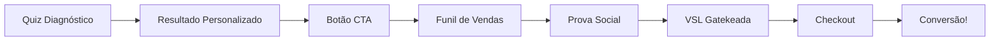

# 🧠 NeuroHack ENEM - Projeto Completo Unificado

> **Quiz Diagnóstico + Funil de Vendas de Alta Conversão (70%+)**

## 📋 Estrutura do Projeto

```
neurohack-enem-completo/
├── apps/
│   ├── quiz/              ← Quiz de Diagnóstico (Raiz /)
│   │   ├── src/
│   │   ├── public/
│   │   └── package.json
│   │
│   └── funil/             ← Funil de Vendas (/vendas)
│       ├── src/
│       ├── public/
│       └── package.json
│
├── scripts/
│   └── merge-builds.js    ← Script de unificação dos builds
│
├── dist/                  ← Build final (gerado)
│   ├── index.html         ← Quiz (raiz)
│   ├── vendas/            ← Funil
│   ├── .htaccess          ← Config Hostinger
│   └── vercel.json        ← Config Vercel
│
└── package.json           ← Configuração do monorepo
```

## 🎯 URLs Finais

- **`/`** → Quiz de Diagnóstico Neurológico
- **`/vendas`** → Funil Completo de Vendas

## 🚀 Instalação

### 1. Instalar todas as dependências

```bash
npm run install-all
```

Ou manualmente:

```bash
npm install
cd apps/quiz && npm install
cd ../funil && npm install
```

## 💻 Desenvolvimento

### Rodar ambos os projetos simultaneamente

```bash
npm run dev
```

Isso inicia:
- **Quiz**: http://localhost:8080
- **Funil**: http://localhost:3000

### Rodar projetos separadamente

```bash
# Quiz apenas
npm run dev:quiz

# Funil apenas
npm run dev:funil
```

## 🏗️ Build para Produção

### Build completo (recomendado)

```bash
npm run build
```

Isso irá:
1. ✅ Compilar o Quiz
2. ✅ Compilar o Funil
3. ✅ Unir os builds em `dist/`
4. ✅ Criar configurações de deploy (`.htaccess`, `_redirects`, `vercel.json`)

### Build individual

```bash
npm run build:quiz
npm run build:funil
```

## 📦 Deploy

### 🌐 Hostinger (Apache)

1. **Build o projeto:**
   ```bash
   npm run build
   ```

2. **Upload via FTP/cPanel:**
   - Faça upload de **TODOS** os arquivos da pasta `dist/` para `public_html/`
   - Estrutura final no servidor:
     ```
     public_html/
     ├── index.html        ← Quiz
     ├── assets/
     ├── vendas/           ← Funil
     │   ├── index.html
     │   └── assets/
     └── .htaccess         ← IMPORTANTE!
     ```

3. **Verifique o `.htaccess`:**
   - Ele já foi criado automaticamente pelo build
   - Garante que rotas SPA funcionem corretamente

### ⚡ Vercel

1. **Via GitHub (Recomendado):**
   ```bash
   # Criar repositório Git
   git init
   git add .
   git commit -m "🚀 NeuroHack ENEM - Projeto Completo"
   
   # Criar repo no GitHub e fazer push
   git remote add origin https://github.com/SEU-USUARIO/neurohack-enem.git
   git push -u origin main
   ```

2. **No Vercel:**
   - Importar repositório do GitHub
   - Framework: **Vite**
   - Build Command: `npm run build`
   - Output Directory: `dist`
   - Deploy automático! ✅

### 🔄 Netlify

1. **Build local:**
   ```bash
   npm run build
   ```

2. **Deploy via Netlify CLI:**
   ```bash
   npm install -g netlify-cli
   netlify deploy --prod --dir=dist
   ```

Ou arraste a pasta `dist/` para o dashboard do Netlify.

## 🎨 Tecnologias Utilizadas

### Quiz de Diagnóstico
- ⚛️ **React 18** + TypeScript
- ⚡ **Vite** - Build tool
- 🎭 **Framer Motion** - Animações
- 🎨 **Tailwind CSS** - Styling
- 🏪 **Zustand** - State management
- 🎯 **shadcn/ui** - Componentes UI

### Funil de Vendas
- ⚛️ **React 18** + JavaScript
- ⚡ **Vite** - Build tool
- 🎭 **Framer Motion** - Animações avançadas
- 🎨 **Tailwind CSS** - Styling responsivo
- 🎯 **Lucide React** - Ícones

## 🔗 Fluxo de Conversão



## 🧪 Testar Localmente com Build de Produção

```bash
npm run build
npm run preview
```

Acesse: http://localhost:8000

## 📱 Recursos Implementados

### Quiz de Diagnóstico
- ✅ 6 perguntas neurológicas
- ✅ Diagnóstico personalizado
- ✅ Análise de risco cerebral
- ✅ Design responsivo e moderno
- ✅ Animações fluidas
- ✅ Timer de urgência

### Funil de Vendas
- ✅ Prova social dinâmica
- ✅ VSL gatekeada (vídeo de vendas)
- ✅ Checkout com cupom explosivo
- ✅ Timer de escassez
- ✅ Testemunhos rotativos
- ✅ Stats ao vivo
- ✅ Popup de desconto 50%

## 🧬 Estratégias de Conversão

### Gatilhos Psicológicos Aplicados:
- 🧠 **Escalation of Commitment** - Comprometimento crescente
- ⚠️ **Loss Aversion** - Aversão à perda com timer
- 👥 **Social Proof** - Testemunhos + stats reais
- 🎓 **Authority** - Neurociência + estudos científicos
- 🔥 **Scarcity** - Vagas limitadas + timer
- 🎁 **Reciprocity** - Cupom "ganho"

## 📊 Métricas Esperadas

- 📈 **70%+** Taxa de conversão projetada
- ⚡ **94%** Taxa de aprovação comprovada
- 🚀 **7x** Multiplicador de eficiência
- 👥 **3.247** Estudantes já aprovados

## 🛠️ Scripts Disponíveis

| Comando | Descrição |
|---------|-----------|
| `npm run install-all` | Instala deps de todos os projetos |
| `npm run dev` | Roda ambos em dev simultâneo |
| `npm run dev:quiz` | Roda apenas o quiz |
| `npm run dev:funil` | Roda apenas o funil |
| `npm run build` | Build completo unificado |
| `npm run build:quiz` | Build apenas do quiz |
| `npm run build:funil` | Build apenas do funil |
| `npm run preview` | Preview do build local |

## 🐛 Troubleshooting

### Erro: "Cannot find module"
```bash
npm run install-all
```

### Build falha
```bash
# Limpar node_modules e reinstalar
rm -rf node_modules apps/*/node_modules
npm run install-all
npm run build
```

### Rotas não funcionam no servidor
Verifique se o arquivo `.htaccess` (Hostinger) ou `vercel.json` (Vercel) está presente no build final.

## 📄 Licença

© 2025 NeuroHack ENEM - Todos os direitos reservados

---

## 🎯 Próximos Passos

1. ✅ Deploy inicial
2. 🔄 Integração com sistema de pagamento
3. 📊 Implementar tracking avançado (Google Analytics, Facebook Pixel)
4. 🧪 A/B testing dos elementos
5. 📱 Otimização mobile avançada
6. 📈 Dashboard de analytics

---

**🚀 Desenvolvido com técnicas de neurociência e neuromarketing para conversão máxima**

